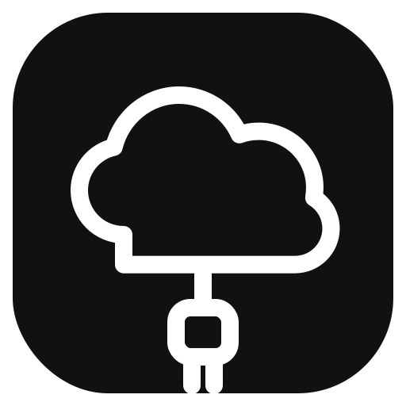

<p align="center">
  
</p>

<p align="center">
  <a href="https://github.com/Nuzair46/Cloudcord/actions/workflows/ci.yml">
    
  </a>
</p>

# Cloudcord

Cloudcord is a local-first Discord bot for exposing services from your machine through Cloudflare Tunnel.

It is designed for local Docker deployments and small self-hosted setups where you want to publish or unpublish a local app from Discord without editing Cloudflare settings by hand.

## Features

- Save local targets under reusable alias names
- Publish aliases from Discord without retyping the local URL
- Use free Cloudflare quick tunnels or a named tunnel
- Persist alias and publication history in SQLite
- Run as a single Docker service
- Work with host apps and same-network Docker services

## How It Works

Cloudcord accepts Discord slash commands and works in two steps:

1. Save a local target URL under an alias with `/add`
2. Publish or unpublish that alias on demand

When you publish an alias, Cloudcord creates one of these:

- A quick tunnel with a random `trycloudflare.com` URL
- A named-tunnel route under your own base domain

Quick tunnels are used when named-tunnel settings are not configured, or when the caller explicitly selects `quick`.

## Commands

- `/add unique_name:<alias> local_url:<url>`
- `/remove unique_name:<alias>`
- `/publish unique_name:<alias> [mode:<auto|quick|named>]`
- `/unpublish unique_name:<alias>`
- `/list`

Command replies are public in the configured Discord channel.

## Alias Rules

- Alias names are normalized to lowercase
- Alias names may contain only letters, numbers, and hyphens
- Updating an alias target while it is actively published is rejected; unpublish it first
- Removing an active alias automatically unpublishes it first

## Named Tunnel Hostnames

When named mode is used, Cloudcord publishes the alias at:

```text
https://<unique_name>.<CLOUDFLARE_BASE_DOMAIN>
```

Example:

- Alias: `docs-api`
- Base domain: `dev.example.com`
- Public URL: `https://docs-api.dev.example.com`

This makes named URLs stable across republish operations for the same alias.

## Requirements

- Docker and Docker Compose
- A Discord bot token
- For named mode only:
  - Cloudflare account API token
  - Cloudflare tunnel token
  - Existing named tunnel
  - Cloudflare zone you control

## Quick Start

1. Copy the example env file if you want to use a project `.env`:

   ```bash
   cp .env.example .env
   ```

2. Fill in the required values

3. Start the bot:

   ```bash
   docker compose up --build
   ```

You can also skip `.env` entirely and export variables from your shell before running `docker compose`.

## Configuration

### Required

- `DISCORD_BOT_TOKEN`
- `DISCORD_GUILD_ID`
- `DISCORD_ALLOWED_CHANNEL_ID`

### Storage

- `SQLITE_PATH`

### Publish policy

- `ALLOW_CONTAINER_HOSTNAMES`
- `ALLOWED_HOSTS`
- `ALLOWED_PORT_RANGES`

### Named tunnel mode

Named mode is enabled only when all of these are set:

- `CLOUDFLARE_API_TOKEN`
- `CLOUDFLARE_TUNNEL_TOKEN`
- `CLOUDFLARE_ACCOUNT_ID`
- `CLOUDFLARE_ZONE_ID`
- `CLOUDFLARE_TUNNEL_ID`
- `CLOUDFLARE_BASE_DOMAIN`

If any of them are missing, `mode:auto` falls back to quick tunnels.

## Named Tunnel Setup

Cloudcord does not create a named tunnel for you. It expects one existing Cloudflare tunnel and then manages routes and DNS on top of it.

1. In Cloudflare Zero Trust, go to `Networking` -> `Tunnels`.
2. Give the tunnel a name and save it.
3. On the connector page, Cloudflare will show a `cloudflared ... --token ...` command.
   Copy the token value from that command and use it as `CLOUDFLARE_TUNNEL_TOKEN`.
4. Copy the tunnel UUID from the tunnel details page and use it as `CLOUDFLARE_TUNNEL_ID`.
5. Create a Cloudflare API token with permission to edit Cloudflare Tunnel config at the account level and edit DNS records for your zone.
6. Set these env vars:

   ```dotenv
   CLOUDFLARE_API_TOKEN=...
   CLOUDFLARE_TUNNEL_TOKEN=...
   CLOUDFLARE_ACCOUNT_ID=...
   CLOUDFLARE_ZONE_ID=...
   CLOUDFLARE_TUNNEL_ID=...
   CLOUDFLARE_BASE_DOMAIN=dev.example.com
   ```

`CLOUDFLARE_BASE_DOMAIN` must be a domain or subdomain in a zone managed by your Cloudflare account. Cloudcord publishes each named alias under that base domain.

You do not need to run `cloudflared` manually outside this project. The Docker container runs it for you.

## Networking Notes

Cloudcord runs inside Docker, so target resolution follows Docker networking rules:

- `localhost` inside the bot container means the bot container itself
- `http://localhost:3000` entered in Discord is rewritten to `http://host.docker.internal:3000`
- Use `host.docker.internal` for apps exposed on the Docker host
- Use a container or service hostname like `http://rails:3000` for apps reachable on the same Docker network
- Target URLs must be origin-only. Do not include a path, query string, or hash.

Examples:

- Host-published app: `http://localhost:3000`
- Host alias explicitly: `http://host.docker.internal:3000`
- Same-network Docker app: `http://rails:3000`

Only local targets are accepted by default. Public internet hostnames are rejected unless explicitly allowlisted.

## Security Model

Anyone who can use the configured Discord channel can add, publish, unpublish, or remove aliases through the bot.

If that is too broad for your setup, do not expose the bot in a shared channel without adding stricter authorization first.

## Limitations

- Only `http` and `https` targets are supported
- Quick tunnels are ephemeral and are not restored after restart
- Named mode requires a pre-existing Cloudflare tunnel
- Docker services on other isolated Docker networks are not automatically reachable

## Troubleshooting

### `Unknown Guild`

If startup fails with `DiscordAPIError[10004]: Unknown Guild`, the bot cannot access the Discord server configured in `DISCORD_GUILD_ID`.

Check:

- `DISCORD_GUILD_ID` is the server ID, not a channel ID
- the bot has been invited to that server
- the bot token belongs to the same application you invited

## Development

Run locally:

```bash
yarn install
yarn build
yarn test
```

Run the Docker config check:

```bash
docker compose config
```
